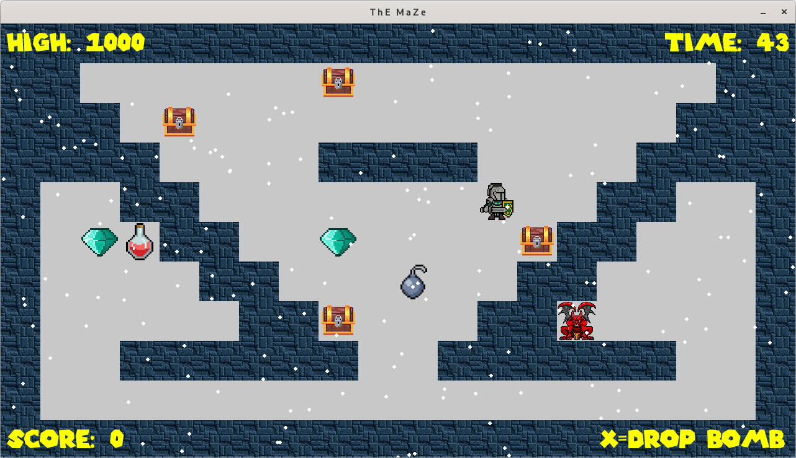

# " T h E   M a Z e "
Another tiny 2D game made with python and pygame. 

Inspired by a tutorial from Franck Dubois, published in "Programmez! Magazine Hors Serie 15"

Extra code, maps and artwork by fabrice.kauffmann@gmail.com




## History

* 2024.07.15 - initial version
* 2024.07.19 - disable player moves if game paused
* 2024.07.21 - random items location
* 2024.07.22 - random player start location
* 2024.07.23 - external map files support
* 2024.07.24 - code refactoring
* 2024.07.25 - more sounds added
* 2024.07.27 - bonus timme added
* 2024.07.31 - monster added
* 2024.08.06 - fixed check of map boundaries
* 2024.08.07 - basic particles generator added
* 2024.08.07 - save high score

## Requirements

* numpy==2.0.1
* pygame==2.6.0

## Setup (Linux)

Navigate to project folder 
```
python3 -m venv .venv
cd .venv
cd bin
source activate
cd ../..
pip install pygame
pip install numpy
python3 main.py
```

## Setup (Windows)

Navigate to project folder 
```
python -m venv .venv
cd .venv
cd scripts
activate
cd ..\..
pip install pygame
pip install numpy
python main.py
```

